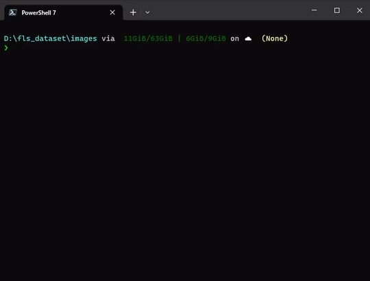

# f[rame]ls

## Description

**framels** project is intent to deliver a *ls* command inspired by *bls* from Buf Compagnie or more recently *rvls* from RV

## Installation

### Pre-compile bin

You can download the last version <https://github.com/doubleailes/fls/releases>

#### Windows

Support Windows 10 x86

#### Linux

Support current linux distro tested Fedora 37, Centos 7, Manjaro 22

### From Cargo

You can install via [<https://crates.io/>](https://crates.io/crates/framels)

Run `cargo install framels`

## Usage

### Help

Run `fls --help`

### basic_listing

Run `fls` to list your current directory.



```bash
$ touch aaa.001.tif aaa.002.tif aaa.003.tif aaa.004.tif aaa.005.tif foo_bar.exr
$ fls
foo_bar.exr
aaa.***.tif@1-5
```

Run `fls -- /path/of/directory/` to list a specific directory.

Exemple with the sample set **big** at the root level of the repo

```bash
$ fls -- samples/big/
RenderPass_Pcam_1_*****.exr@0-96
RenderPass_Beauty_1_*****.exr@0-96
RenderPass_IndDiffuse_1_*****.exr@0-96
RenderPass_Ncam_1_*****.exr@0-41,43-96
RenderPass_Specular_1_*****.exr@0-96
RenderPass_Id_1_*****.exr@0-96
RenderPass_Occlusion_1_***.exr@74
RenderPass_Reflection_1_*****.exr@0-96
RenderPass_SpecularRim_1_*****.exr@0-96
RenderPass_Ncam_1_00042.exr.bkp
RenderPass_DiffuseKey_1_*****.exr@0-96
RenderPass_Diffuse_1_*****.exr@0-96
RenderPass_Occlusion_1_*****.exr@0-73,75-96
```

### Exr Metadata

Inspired by rvls. You can use `-l`

Run `fls -l` to list your current directory and display EXR informations.

Run `fls -l -- /path/of/directory/` to list a specific directory and display EXR informations.

```bash
$ fls -l -- samples/big/
RenderPass_Beauty_1_*****.exr@0-96
RenderPass_Occlusion_1_*****.exr@0-73,75-96
RenderPass_Id_1_*****.exr@0-96
RenderPass_Occlusion_1_***.exr@74
RenderPass_Ncam_1_00042.exr.bkp
RenderPass_SpecularRim_1_*****.exr@0-96
RenderPass_DiffuseKey_1_*****.exr@0-96
RenderPass_Pcam_1_*****.exr@0-96
RenderPass_Reflection_1_*****.exr@0-96
RenderPass_Specular_1_*****.exr@0-96
RenderPass_Diffuse_1_*****.exr@0-96
RenderPass_IndDiffuse_1_*****.exr@0-96
RenderPass_Ncam_1_*****.exr@0-41,43-96
.\samples\big\RenderPass_Beauty_1_00000.exr layer #0 size:Vec2(320, 143); channels:ChannelList { list: [ChannelDescription { name: exr::Text("A"), sample_type: F16, quantize_linearly: false, sampling: Vec2(1, 1) }, ChannelDescription { name: exr::Text("B"), sample_type: F16, quantize_linearly: false, sampling: Vec2(1, 1) }, ChannelDescription { name: exr::Text("G"), sample_type: F16, quantize_linearly: false, sampling: Vec2(1, 1) }, ChannelDescription { name: exr::Text("Plane_Beauty.A"), sample_type: F16, quantize_linearly: false, sampling: Vec2(1, 1) }, ChannelDescription { name: exr::Text("Plane_Beauty.B"), sample_type: F16, quantize_linearly: false, sampling: Vec2(1, 1) }, ChannelDescription { name: exr::Text("Plane_Beauty.G"), sample_type: F16, quantize_linearly: false, sampling: Vec2(1, 1) }, ChannelDescription { name: exr::Text("Plane_Beauty.R"), sample_type: F16, quantize_linearly: false, sampling: Vec2(1, 1) }, ChannelDescription { name: exr::Text("R"), sample_type: F16, quantize_linearly: false, sampling: Vec2(1, 1) }, ChannelDescription { name: exr::Text("Spheres_Beauty.A"), sample_type: F16, quantize_linearly: false, sampling: Vec2(1, 1) }, ChannelDescription { name: exr::Text("Spheres_Beauty.B"), sample_type: F16, quantize_linearly: false, sampling: Vec2(1, 1) }, ChannelDescription { name: exr::Text("Spheres_Beauty.G"), sample_type: F16, quantize_linearly: false, sampling: Vec2(1, 1) }, ChannelDescription { name: exr::Text("Spheres_Beauty.R"), sample_type: F16, quantize_linearly: false, sampling: Vec2(1, 1) }], bytes_per_pixel: 24, uniform_sample_type: Some(F16) }
.\samples\big\RenderPass_Occlusion_1_00000.exr layer #0 size:Vec2(320, 139); channels:ChannelList { list: [ChannelDescription { name: exr::Text("A"), sample_type: F16, quantize_linearly: false, sampling: Vec2(1, 1) }, ChannelDescription { name: exr::Text("B"), sample_type: F16, quantize_linearly: false, sampling: Vec2(1, 1) }, ChannelDescription { name: exr::Text("G"), sample_type: F16, quantize_linearly: false, sampling: Vec2(1, 1) }, ChannelDescription { name: exr::Text("R"), sample_type: F16, quantize_linearly: false, sampling: Vec2(1, 1) }], bytes_per_pixel: 8, uniform_sample_type: Some(F16) }
.\samples\big\RenderPass_Id_1_00000.exr layer #0 size:Vec2(140, 52); channels:ChannelList { list: [ChannelDescription { name: exr::Text("A"), sample_type: F16, quantize_linearly: false, sampling: Vec2(1, 1) }, ChannelDescription { name: exr::Text("B"), sample_type: F16, quantize_linearly: false, sampling: Vec2(1, 1) }, ChannelDescription { name: exr::Text("G"), sample_type: F16, quantize_linearly: false, sampling: Vec2(1, 1) }, ChannelDescription { name: exr::Text("R"), sample_type: F16, quantize_linearly: false, sampling: Vec2(1, 1) }], bytes_per_pixel: 8, uniform_sample_type: Some(F16) }
.\samples\big\RenderPass_Occlusion_1_074.exr layer #0 size:Vec2(320, 156); channels:ChannelList { list: [ChannelDescription { name: exr::Text("A"), sample_type: F16, quantize_linearly: false, sampling: Vec2(1, 1) }, ChannelDescription { name: exr::Text("B"), sample_type: F16, quantize_linearly: false, sampling: Vec2(1, 1) }, ChannelDescription { name: exr::Text("G"), sample_type: F16, quantize_linearly: false, sampling: Vec2(1, 1) }, ChannelDescription { name: exr::Text("R"), sample_type: F16, quantize_linearly: false, sampling: Vec2(1, 1) }], bytes_per_pixel: 8, uniform_sample_type: Some(F16) }
Not an exr
.\samples\big\RenderPass_SpecularRim_1_00000.exr layer #0 size:Vec2(320, 143); channels:ChannelList { list: [ChannelDescription { name: exr::Text("A"), sample_type: F16, quantize_linearly: false, sampling: Vec2(1, 1) }, ChannelDescription { name: exr::Text("B"), sample_type: F16, quantize_linearly: false, sampling: Vec2(1, 1) }, ChannelDescription { name: exr::Text("G"), sample_type: F16, quantize_linearly: false, sampling: Vec2(1, 1) }, ChannelDescription { name: exr::Text("R"), sample_type: F16, quantize_linearly: false, sampling: Vec2(1, 1) }], bytes_per_pixel: 8, uniform_sample_type: Some(F16) }
.\samples\big\RenderPass_DiffuseKey_1_00000.exr layer #0 size:Vec2(320, 143); channels:ChannelList { list: [ChannelDescription { name: exr::Text("A"), sample_type: F16, quantize_linearly: false, sampling: Vec2(1, 1) }, ChannelDescription { name: exr::Text("B"), sample_type: F16, quantize_linearly: false, sampling: Vec2(1, 1) }, ChannelDescription { name: exr::Text("G"), sample_type: F16, quantize_linearly: false, sampling: Vec2(1, 1) }, ChannelDescription { name: exr::Text("R"), sample_type: F16, quantize_linearly: false, sampling: Vec2(1, 1) }], bytes_per_pixel: 8, uniform_sample_type: Some(F16) }
.\samples\big\RenderPass_Pcam_1_00000.exr layer #0 size:Vec2(320, 143); channels:ChannelList { list: [ChannelDescription { name: exr::Text("A"), sample_type: F32, quantize_linearly: false, sampling: Vec2(1, 1) }, ChannelDescription { name: exr::Text("B"), sample_type: F32, quantize_linearly: false, sampling: Vec2(1, 1) }, ChannelDescription { name: exr::Text("G"), sample_type: F32, quantize_linearly: false, sampling: Vec2(1, 1) }, ChannelDescription { name: exr::Text("R"), sample_type: F32, quantize_linearly: false, sampling: Vec2(1, 1) }], bytes_per_pixel: 16, uniform_sample_type: Some(F32) }
.\samples\big\RenderPass_Reflection_1_00000.exr layer #0 size:Vec2(320, 143); channels:ChannelList { list: [ChannelDescription { name: exr::Text("A"), sample_type: F16, quantize_linearly: false, sampling: Vec2(1, 1) }, ChannelDescription { name: exr::Text("B"), sample_type: F16, quantize_linearly: false, sampling: Vec2(1, 1) }, ChannelDescription { name: exr::Text("G"), sample_type: F16, quantize_linearly: false, sampling: Vec2(1, 1) }, ChannelDescription { name: exr::Text("R"), sample_type: F16, quantize_linearly: false, sampling: Vec2(1, 1) }], bytes_per_pixel: 8, uniform_sample_type: Some(F16) }
.\samples\big\RenderPass_Specular_1_00000.exr layer #0 size:Vec2(320, 143); channels:ChannelList { list: [ChannelDescription { name: exr::Text("A"), sample_type: F16, quantize_linearly: false, sampling: Vec2(1, 1) }, ChannelDescription { name: exr::Text("B"), sample_type: F16, quantize_linearly: false, sampling: Vec2(1, 1) }, ChannelDescription { name: exr::Text("G"), sample_type: F16, quantize_linearly: false, sampling: Vec2(1, 1) }, ChannelDescription { name: exr::Text("R"), sample_type: F16, quantize_linearly: false, sampling: Vec2(1, 1) }], bytes_per_pixel: 8, uniform_sample_type: Some(F16) }
.\samples\big\RenderPass_Diffuse_1_00000.exr layer #0 size:Vec2(320, 143); channels:ChannelList { list: [ChannelDescription { name: exr::Text("A"), sample_type: F16, quantize_linearly: false, sampling: Vec2(1, 1) }, ChannelDescription { name: exr::Text("B"), sample_type: F16, quantize_linearly: false, sampling: Vec2(1, 1) }, ChannelDescription { name: exr::Text("G"), sample_type: F16, quantize_linearly: false, sampling: Vec2(1, 1) }, ChannelDescription { name: exr::Text("R"), sample_type: F16, quantize_linearly: false, sampling: Vec2(1, 1) }], bytes_per_pixel: 8, uniform_sample_type: Some(F16) }
.\samples\big\RenderPass_IndDiffuse_1_00000.exr layer #0 size:Vec2(320, 143); channels:ChannelList { list: [ChannelDescription { name: exr::Text("A"), sample_type: F16, quantize_linearly: false, sampling: Vec2(1, 1) }, ChannelDescription { name: exr::Text("B"), sample_type: F16, quantize_linearly: false, sampling: Vec2(1, 1) }, ChannelDescription { name: exr::Text("G"), sample_type: F16, quantize_linearly: false, sampling: Vec2(1, 1) }, ChannelDescription { name: exr::Text("R"), sample_type: F16, quantize_linearly: false, sampling: Vec2(1, 1) }], bytes_per_pixel: 8, uniform_sample_type: Some(F16) }
.\samples\big\RenderPass_Ncam_1_00000.exr layer #0 size:Vec2(320, 143); channels:ChannelList { list: [ChannelDescription { name: exr::Text("A"), sample_type: F16, quantize_linearly: false, sampling: Vec2(1, 1) }, ChannelDescription { name: exr::Text("B"), sample_type: F16, quantize_linearly: false, sampling: Vec2(1, 1) }, ChannelDescription { name: exr::Text("G"), sample_type: F16, quantize_linearly: false, sampling: Vec2(1, 1) }, ChannelDescription { name: exr::Text("R"), sample_type: F16, quantize_linearly: false, sampling: Vec2(1, 1) }], bytes_per_pixel: 8, uniform_sample_type: Some(F16) }
```

### Recursive

You can use a recursive approch of the directory and sub-folder

You can use `-r`

Run `fls -r -- /path/of/directory/` to list a specific directory and his
subfolder

```bash
$ fls -r -- .\samples\
.\samples\big\RenderPass_Diffuse_1_*****.exr@0-96
.\samples\big\RenderPass_Ncam_1_00042.exr.bkp
.\samples\big\RenderPass_DiffuseKey_1_*****.exr@0-96
.\samples\big\RenderPass_Occlusion_1_*****.exr@0-73,75-96
.\samples\big\RenderPass_Occlusion_1_***.exr@74
.\samples\small\foo_bar.exr
.\samples\big\RenderPass_SpecularRim_1_*****.exr@0-96
.\samples\big\RenderPass_Pcam_1_*****.exr@0-96
.\samples\big\RenderPass_Ncam_1_*****.exr@0-41,43-96
.\samples\small
.\samples\big
.\samples\big\RenderPass_Id_1_*****.exr@0-96
.\samples\big\RenderPass_Specular_1_*****.exr@0-96
.\samples\big\RenderPass_Beauty_1_*****.exr@0-96
.\samples
.\samples\big\RenderPass_IndDiffuse_1_*****.exr@0-96
.\samples\big\RenderPass_Reflection_1_*****.exr@0-96
.\samples\small\aaa.***.tif@1-5
```

## Benchmarks

Using the sample **big**, some time comparaison with `rvls` or `lsseq`

| Tool | `fls`    | `rvls`   |`lsseq -l`|
|------|----------|----------|----------|
| Time | 0m0.007s | 0m0.069s | 0m0.034s | 

## Issues and PR

Issues, feedback and PR are welcome

Some hard rules, i won't trade off

- Windows compatible
- Speed
- UTF8 friendly
- Pure Rust

## Thanks

Thanks to:

- Ben Legros for the passive mentorship over a beer ( or many )
- Djl for the idea
- Tcherno
- Mercenaries Eng for the best render engine ( samples/big render with [Guerilla render](http://guerillarender.com/) )
